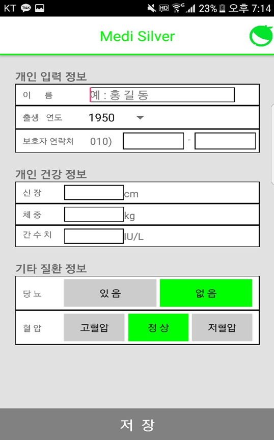
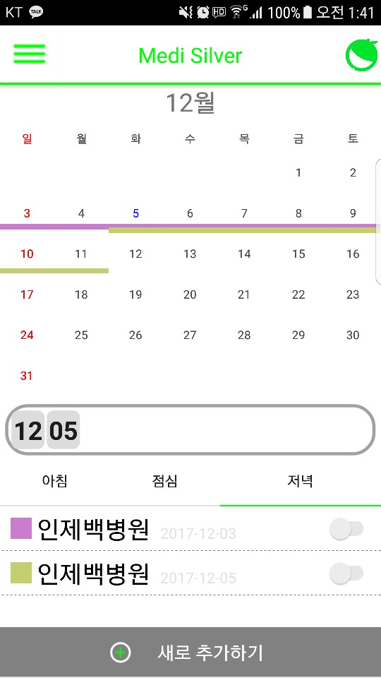
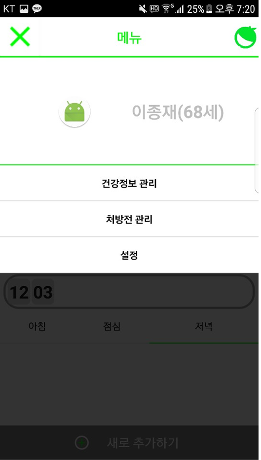
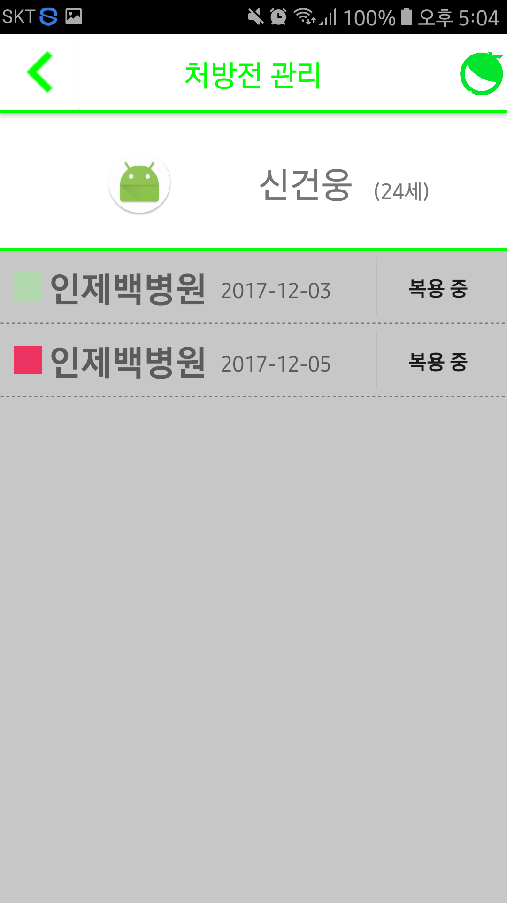
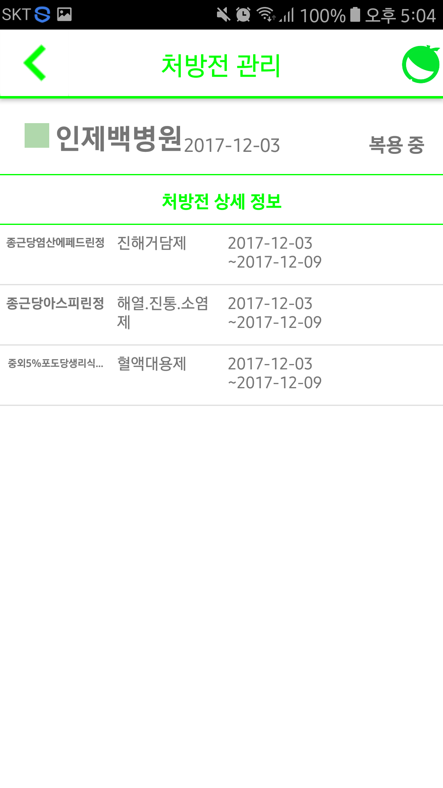
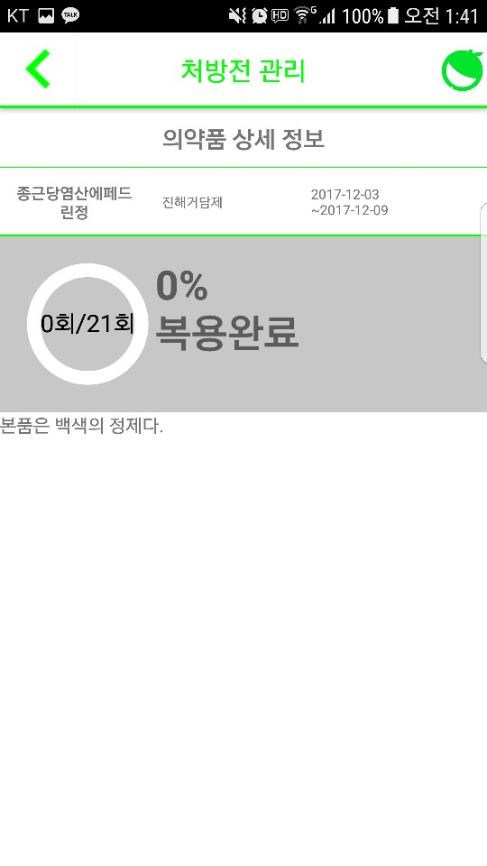

# medisilver

University Graduation Work

> 🏫 University: Inje  
> 🛠 Team: Geonwoong.Shin, Youngjin.Park, Jongjae.Lee, Taehyeon.Ryu (ryu-coding)  
> 🗓 Development Date: 2017.10 ~ 2018.05

## 🎯 Purpose

- App for adults (50s to 60s) who frequently visit hospitals.
- At the time (2017), the shortcomings of commercially released applications were improved and a convenient UI was provided.
- **Prescription management app using prescription QR code**

## 🚀 Usage

## Author

🙋‍♂️ codingnanyong (TaeHyeon.Ryu)

- Personal Email: [codingnanyong@gmail.com](mailto:codingnanyong@gmail.com)

## 📝 License

- This project is freely licensed.
- You can use and refer to it.
- Currently, no further development is underway.
